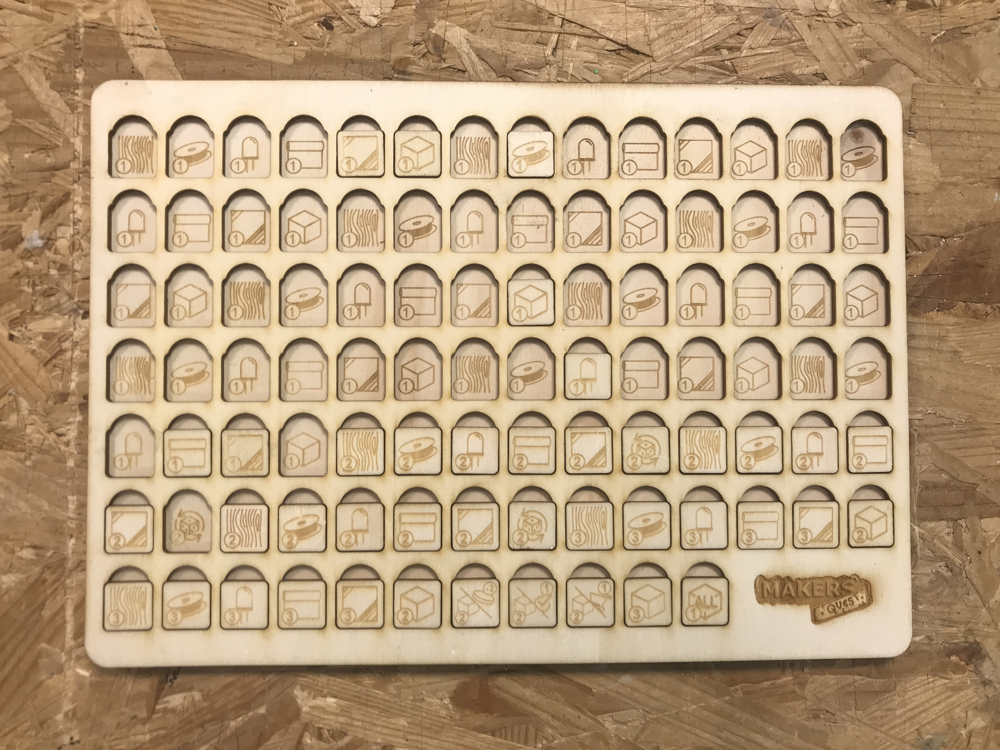

## CONTENU

La banque de faces de dés sert à ranger les faces de dés qui sont disponibles pendant une partie : au début de la partie, on y prélève les faces nécessaires pour "remplir" 2 dés par joueurs (maximum 5 joueurs).

## FABRICATION

Le fichier .svg contient 2 calques (ouvrir avec Inkscape de préférence) : 

- un calque pour le fond, où seront gravés les emplacements des faces de dés
- un calque pour le dessus, avec les ouvertures pour placer les dés

Les fichiers sont prévus pour être gravés et découpés au laser, de préférence sur du contreplaqué de 3 ou 5mm d'épaisseur. Collez les deux faces ensembles à la colle à bois.

