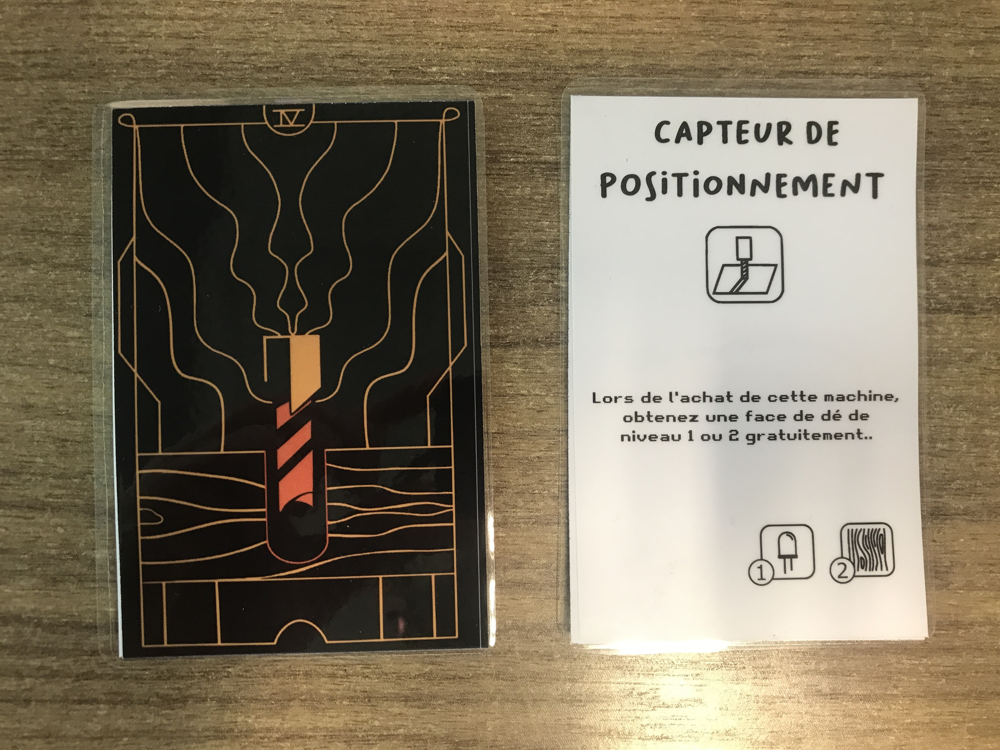

## Contenu
Vous trouverez ici toutes les cartes du jeu :

- Les cartes machines, classées par type de machine
- Les cartes événement
- Les cartes projets, clasées par niveau de difficulté
- Les cartes personnages
- Les cartes aide (vous pouvez en faire de 2 à 5 par jeu)

Reportez-vous au manuel du jeu pour plus de détails sur la répartition des cartes.

## Fabrication
Nous avons testé deux modes de fabrication :

- Impression des cartes en recto/verso sur papier épais (grammage 120g ou supérieur), puis plastification.
- Impression des cartes directement sur vinyle adhésif, ce qui nécessite d'avoir accès à une machine permettant l'impression et la découpe sur vinyle adhésif.

Les fichiers fournis sont prévus pour une impression recto-verso. Si vous utilisez un papier plus épais que 120g, la plastification n'est pas obligatoire, mais elle permet une meilleure manipulation des cartes, qui glisseront mieux les unes contre les autres !

Matériel requis :

- Papier grammage épais (minimum 120g)
- Imprimante couleur recto/verso
- Plastifieuse et pochettes à plastifier
- Paire de ciseaux et/ou massicot pour séparer les cartes une fois imprimées
- En option : un arrondisseur d'angles (fourni avec notre plastifieuse) pour avoir des coins arrondis et moins coupants. Astuce : si vous n'avez pas d'arrondisseur d'angle, vous pouvez aussi utiliser un coupe-ongles ;)

