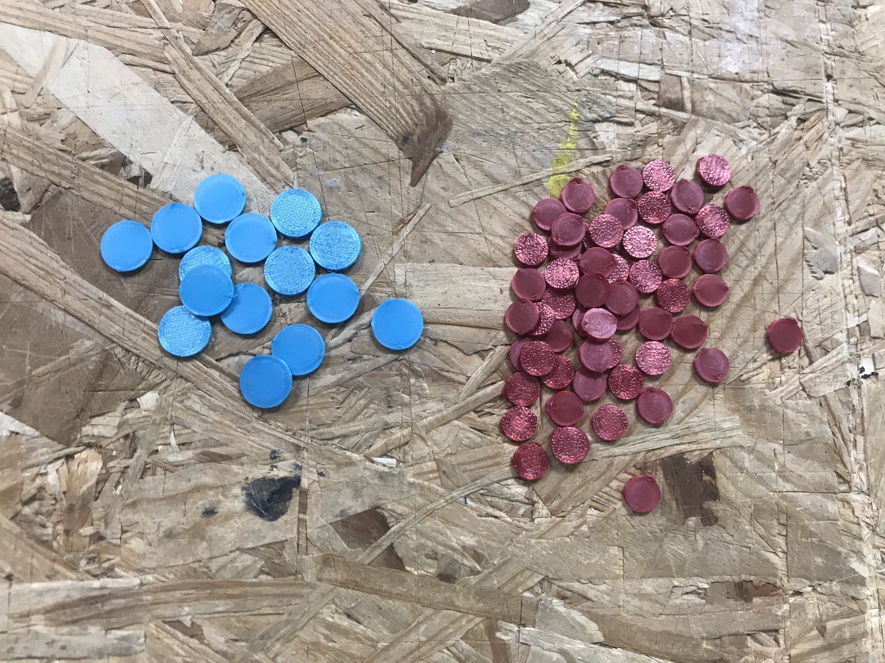

## Contenu

Vous trouverez ici les fichier pour fabriquer les jetons utilisés sur les cartes, pour signifier :

- l'occupation d'une machine (petits jetons de 8mm)
- l'activation d'un pouvoir (grands jetons de 12mm)

## Fabrication

Vous pouvez soit fabriquer ces jetons en découpe laser à l'aide du fichier jetons.svg, en choisissant un matériau pas trop épais, soit en impression 3D.
**Il faut environs 15 grands jetons et 60 petits par jeu.**

