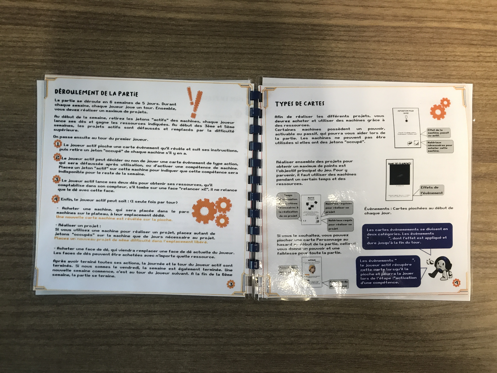

## Contenu   
Ce dossier contient les 6 pages du manuel du jeu.
Il contient toutes les instructions nécessaires pour la prise en main du jeu. Se référer au document word des [règles](https://github.com/FLDescartes/Makers-Quest/blob/main/Mecanique_de_jeu/Regles/Regles.docx) si nécessaire.

## Fabrication
Vous êtes libre de le fabriquer comme bon vous semble ! Nous avons testé l'impression recto verso en 3 "cartes", ou bien la reliure, avec plastification des pages pour plus de durabilité. On peut aussi tout à fait l'imprimer en un seul grand dépliant.

