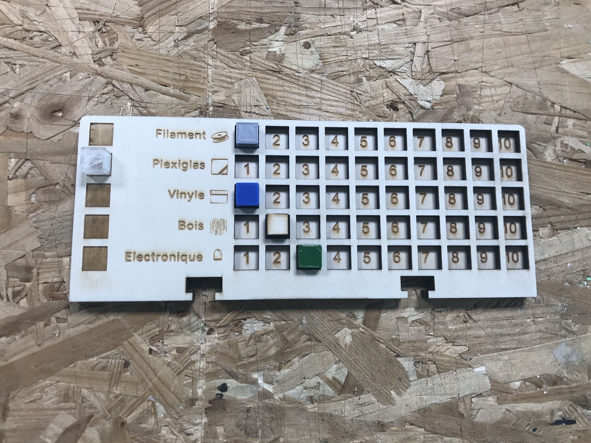

## Contenu

Ce dossier contient la plaquette permettant de gérer les ressources matériau durant une partie, ainsi que les cubes ressources.

## Fabrication

La plaquette ressource est constituée de deux couches, à découper et graver au laser, de préférence dans du contreplaqué de 3 ou 5mm d'épaisseur.
Les carrés noirs sur la partie gauche de la face supérieur, sont prévus pour pouvoir graver l'emplacement des cubes au début de la partie ou lorsque que la ressource est à zéro. Nous recommendons de les graver plusieurs fois pour avoir plus de profondeur et que le cube tienne mieux en place.
**Il faut 5 plaquettes ressources maximum par jeu.**

Les cubes peuvent être soit découpés au laser dans un matériaux de 10mm d'épaisseur, soit imprimés en 3D (fichier .stl fourni), soit les deux. Nous avons choisi d'imprimer en 3D dans différentes couleurs pour simuler les différents matériaux, et de découper au laser dans du contreplaqué les cubes de ressource "bois".
**Il faut 5 cubes ressources par personne, donc un maximum de 25 au total.**

