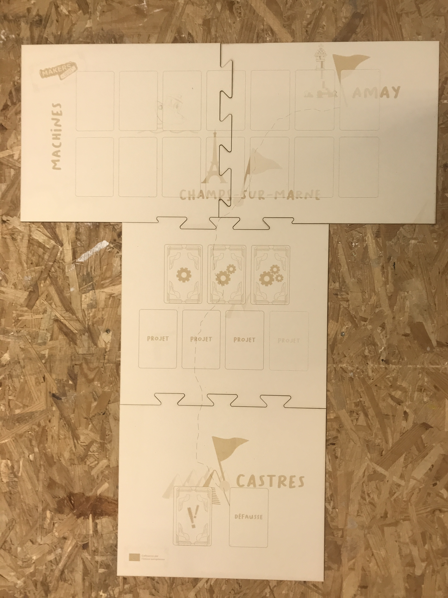

## Contenu

Ce dossier contient les fichiers permettant de fabriquer le plateau de jeu.
Un fichier .svg est disponible avec le plateau de jeu entier, et chacune des quatre partie est également disponible en .svg et .pdf. Le plateau a été ainsi découpé pour permettre un rangement dans une boite de taille raisonnable.
Vous pouvez, si vous le souhaitez, modifier les fichiers afin de pouvoir fabriquer un plateau pliable plutôt qu'en plusieurs parties.

Pour la petite histoire, les décorations sur le plateau de jeu représentent une carte avec l'emplacement des 3 Fablabs qui ont réalisé ce projet (Amay, Champs-sur-Marne, Castres).

## Fabrication

Le plateau de jeu est prévu pour être gravé et découpé au laser, mais vous pouvez tout aussi bien réaliser les décorations avec une imprimante et les coller sur les plaques découpées au préalable.
Nous avons réalisé nos exemplaires avec du carton bois 2mm, qui a l'avantage d'offrir un très bon rendu de gravure et de permettre des variations de teinte assez fines.
Fabriquez simplement un exemplaire de chaque pièce du plateau et assemblez-les comme un puzzle pour la mise en place du jeu.

